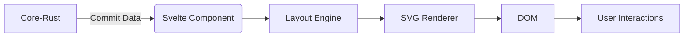

# Commit Graph 2D Migration Plan

## Objective
Replace current 3D Three.js implementation with optimized 2D SVG visualization featuring:
- Proper git branch/merge layout
- Native browser zoom/pan
- Adjacent message labels
- Performant rendering

## Architecture Changes


## Implementation Steps

### 1. SVG Rendering System
- Remove Three.js dependencies
- Create SVG-based component structure:
```svelte
<svg class="graph-container">
  <g class="viewport">
    <!-- Links -->
    <path class="link" d={linkPath} />
    <!-- Commits -->
    <g class="commit-node" transform={position}>
      <circle r="5" />
      <foreignObject class="message">
        <div>{message}</div>
      </foreignObject>
    </g>
  </g>
</svg>
```

### 2. Layout Engine
Implement column-based layout algorithm:
```ts
interface LayoutCommit extends CommitNode {
  column: number;
  x: number; 
  y: number;
  color: string;
}

class CommitGraphLayout {
  layout(commits: CommitNode[]): LayoutCommit[] {
    // 1. Topological sort
    // 2. Assign columns to branches
    // 3. Calculate merge positions
    // 4. Set x/y coordinates
  }
}
```

### 3. Interaction System
- Pan: Implement via `pointerdown` + `pointermove`
- Zoom: Use `wheel` event with transform matrix
- Hover: Native CSS hover states
```svelte
<script>
  let view = { x: 0, y: 0, scale: 1 };
  
  function handlePan(e) {
    // Update view.x/y based on delta
  }
</script>

<svg on:pointerdown={handlePanStart}
     on:pointermove={handlePanMove}
     on:wheel={handleZoom}>
</svg>
```

## Code Migration Strategy

1. Phase 1: Create new component (`commit-graph-2d.svelte`)
2. Phase 2: Implement layout engine in `graphLayout2d.ts`
3. Phase 3: Add transition feature between old/new implementations
4. Phase 4: Remove Three.js code after validation

## Timeline

| Milestone | Estimate |
|-----------|----------|
| SVG Prototype | 2 days |
| Layout Engine | 3 days |
| Interaction System | 1.5 days |
| Testing/Polish | 1 day |
| Total | 7.5 days |

## Dependencies
- Add `d3-zoom` for complex pan/zoom handling
- Remove `three` from package.json