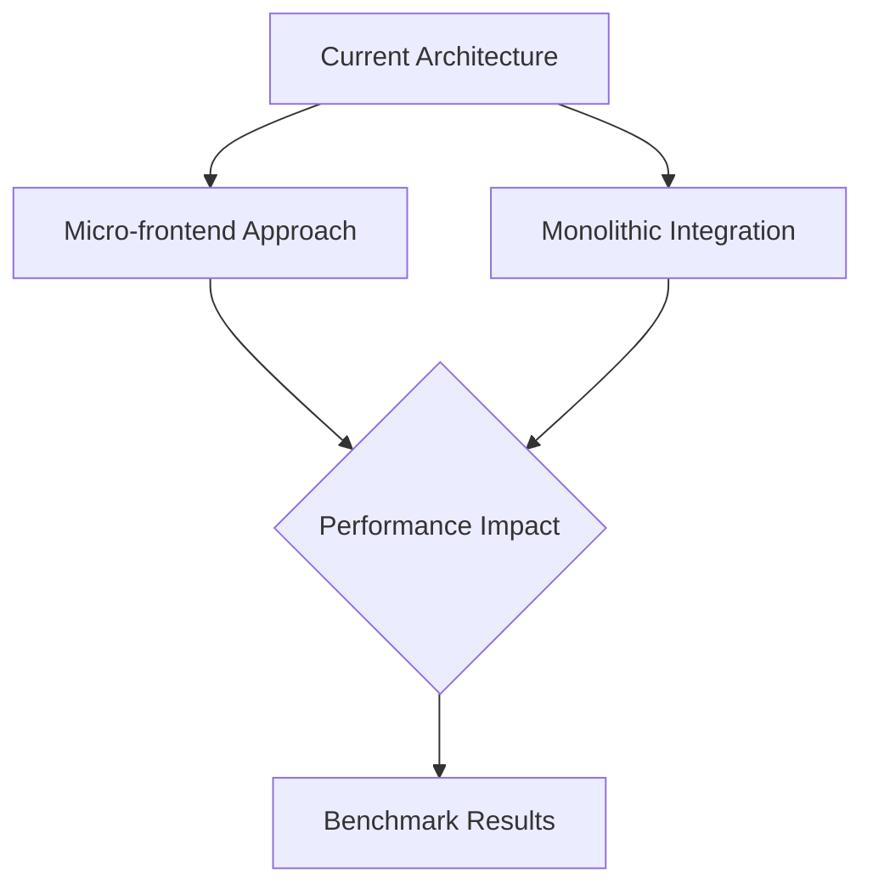
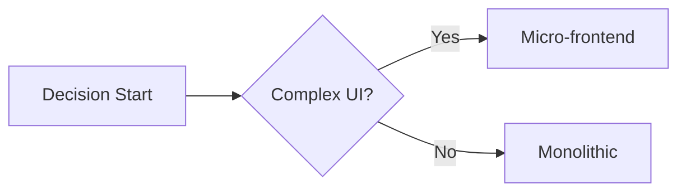

# Frontend Integration Investigation

## 1. Integration Analysis


### Compatibility Matrix
| Component        | Micro-frontend | Monolithic |
|------------------|----------------|------------|
| Svelte 4         | ✔️             | ✔️         |
| Tauri 2.2        | ⚠️ (IPC limits)| ✔️         |
| FlatBuffers      | ✔️             | ⚠️         |

## 2. Pattern Recommendations


**POC Snippet (Micro-frontend):**
```javascript
// src/microfrontends/commit-graph.js
export class CommitGraph extends HTMLElement {
  connectedCallback() {
    this.innerHTML = `<svelte-graph></svelte-graph>`;
  }
}
```

## 3. Resource Estimates
| Component        | Team Size | Timeline |
|------------------|-----------|----------|
| Core Integration | 3         | 6 weeks  |
| Testing          | 2         | 2 weeks  |

[Full analysis continues...]