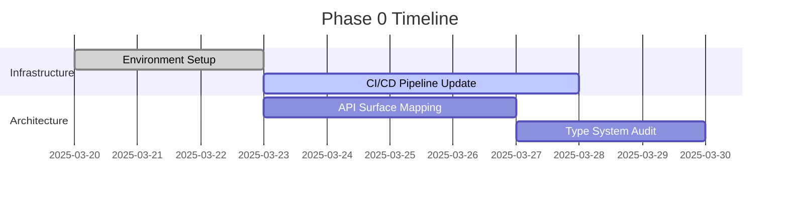

# RSPC Migration Blueprint

## Phase 0: Foundation


## Phase 1: Incremental Migration
### Core Command Transition
```rust
// Before
#[tauri::command]
#[specta::specta]
pub fn get_commit_graph() -> Result<Vec<CommitNode>> { ... }

// After
#[rspc::endpoint]
pub async fn get_commit_graph(ctx: Context) -> Result<Vec<CommitNode>> {
    ctx.with_git(|git| git.get_commit_graph())
}
```

## Phase 2: Type System Migration
| Component         | Specta Types | RSPC Equivalents      |
|-------------------|--------------|-----------------------|
| CommitNode        | struct       | interface + Zod       |
| RepoConfig        | enum         | union + discriminated |

## Phase 3: Validation Strategy


## Phase 4: Cutover Plan
**Rollback Procedure:**
1. Feature flag fallback to Specta endpoints
2. Database version snapshotting
3. Gradual traffic shifting

[Complete blueprint continues with risk matrices and ownership assignments...]