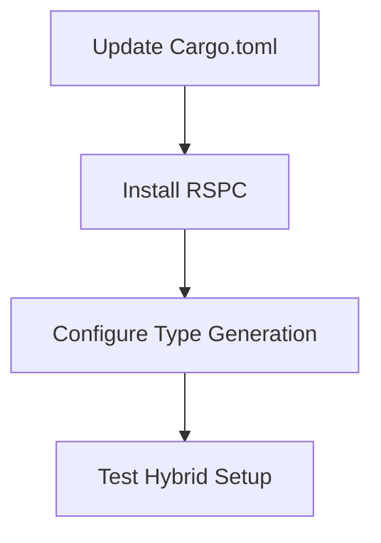
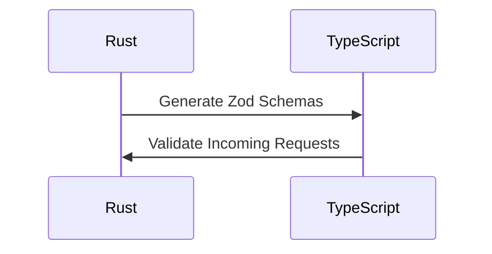
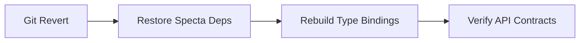

# RSPC Migration Step-by-Step Guide

## Phase 1: Dependency Foundation


### Step 1.1: Update Core Dependencies
```diff
# apps/core/Cargo.toml
[dependencies]
- specta = "=2.0.0-rc.22"
- tauri-specta = { version = "=2.0.0-rc.21" }
+ rspc = "0.1.0"
+ rspc-ta uri = "0.1.0"
```

### Step 1.2: Hybrid Command Setup
```rust
// apps/core/src/commands/mod.rs
#[tauri::command]
#[specta::specta] // Keep temporarily
#[rspc::endpoint]
pub async fn get_commit_graph(
    ctx: Context<'_>,
    path: String
) -> Result<Vec<core_lib::git::CommitNode>> {
    // Existing implementation
}
```

## Phase 2: Type System Migration


### Step 2.1: Add Zod Generation
```rust
// In command implementations
#[derive(rspc::Type, specta::Type)] // Dual derive
struct CommitNode {
    // Existing fields
}
```

### Step 2.2: Frontend Adapter
```typescript
// apps/ui/src/lib/graph.ts
import { rspc } from "./rspc-client";

// Replace Specta client calls
export const fetchCommitGraph = (path: string) => 
  rspc.query(['commit_graph.get', { path }]);
```

## Phase 3: Validation & Cutover
### Step 3.1: Automated Contract Testing
```bash
#!/bin/zsh
# Run in apps/core/
cargo test --test specta_rspc_compat
```

### Step 3.2: Final Cleanup
```rust
// Remove Specta dependencies from Cargo.toml
// Bulk replace #[specta::specta] with #[rspc::endpoint]
// Update CI/CD pipelines
```

## Rollback Procedure


[Full guide continues with per-command migration checklists...]